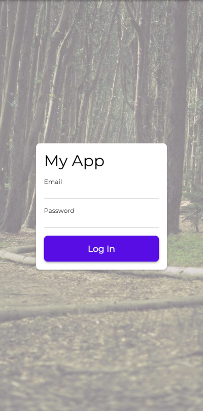
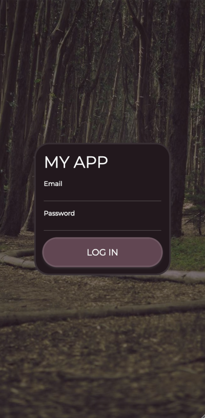

# KiteUI

A Kotlin Multiplatform UI Framework inspired by Solid.js.

## Goals

- Small JS size
- Web Client and server-side rendering, Android, iOS, eventually desktop
- Pretty by default - ugliness should take effort
- Simple Routing
- Easy to extend into native components on the platform
- Make loading and issue handling pretty without manual work

## Interesting design decisions

- Base navigation around URLs to be very compatible with web
- Use fine-grained reactivity
- Use themes for styling; avoid direct styling.
- Derive theme variants from existing themes.  Make theme variants semantically based.
- Don't use a KMP network client, they're all too big - include a custom, simpler, and more limited implementation

## Project Status

Early in development.  Web is basically usable at this point, but everything is subject to change.

### TO DO:

- [ ] Some kind of simple validation system
- [ ] Server-side rendering

## Take a look!

You can look at the [example project we're hosting](https://kiteui.cs.lightningkite.com/) to get an idea of what you can do.

Click the magnifying glass in the app to see the source!

### One example directly on this page:

[See for yourself](https://kiteui.cs.lightningkite.com/sample/login)

If you want to try another theme, start [here](https://kiteui.cs.lightningkite.com/), change the theme, then go to the "Sample Log In" sreen.

 

```kotlin
@Routable("sample/login")
object SampleLogInPage : Page {
    override fun ViewWriter.render(): ViewModifiable = run {
        val email = Property("")
        val password = Property("")
        frame {
            gap = 0.rem
            image {
                source = Resources.imagesSolera
                scaleType = ImageScaleType.Crop
                opacity = 0.5
            }
            padded - scrolling - col {
                expanding - space()
                centered - sizeConstraints(maxWidth = 50.rem) - card - col {
                    h1 { content = "My App" }
                    sizeConstraints(width = 20.rem) - field("Email") {
                        fieldTheme - textInput {
                            hint = "Email"
                            keyboardHints = KeyboardHints.email
                            content bind email
                        }
                    }
                    sizeConstraints(width = 20.rem) - field("Password") {
                        fieldTheme - textInput {
                            hint = "Password"
                            keyboardHints = KeyboardHints.password
                            content bind password
                            action = Action(
                                title = "Log In",
                                icon = Icon.login,
                            ) {
                                fakeLogin(email)
                            }
                        }
                    }
                    centered - sizeConstraints(width = 15.rem) - important - button {
                        h6 { content = "Log In" }
                        onClick {
                            delay(1000)
                            fakeLogin(email)
                        }
                    }
                }
                expanding - space()
            }
        }
    }

    private suspend fun ViewWriter.fakeLogin(email: Property<String>) {
        fetch("fake-login/${email()}")
        pageNavigator.navigate(ControlsPage)
    }
}
```
